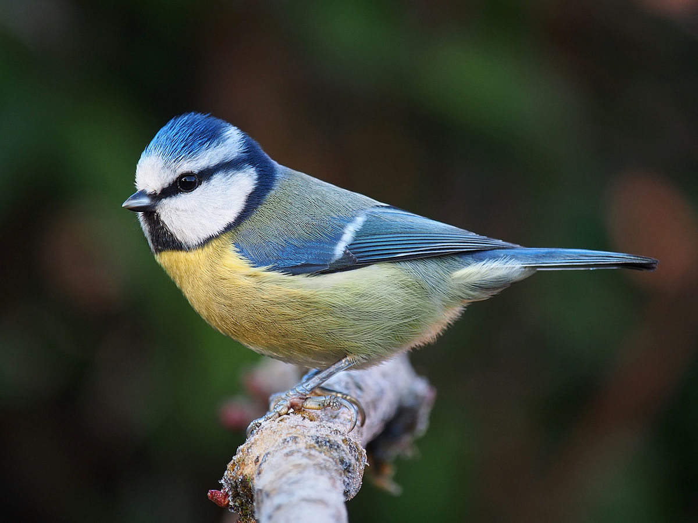

# Cinciarellang🐦!

Cinciarellang🐦 is a brand-new multi-paradigm✨ scripting language🐱‍💻, running on top of the JVM ☕.

Its main features include:

* Deep and immutable copies of objects📋🧊
* Pure and impure functions λ x ➜ x
* Terse and sugary high-level syntax 🍭🍬
* Support for Java classes and objects ☕

> ⚠️ Please note that this project is just a proof of concept, currently (and probably never) ready for production!⚠️

## Wiki 📚 
An informal description of the language is available **-˃ [on the wiki](./docs/wiki/README.md) ˂-**.

## Building 🚧
To build it on your favorite *nix system, run the `./build.sh` script. You'll want to have the Java ≥11 SDK installed. You can then run the interpreter from the (newly generated) `dist/` directory.

## Contributing 🤝
If you find a bug and want to fix it, or if you have an idea for a new feature and you implement it, please feel free to open up a pull-request. I don't guarantee that it will be immediately merged into main, but I will definitely read it and tell you my opinion.
